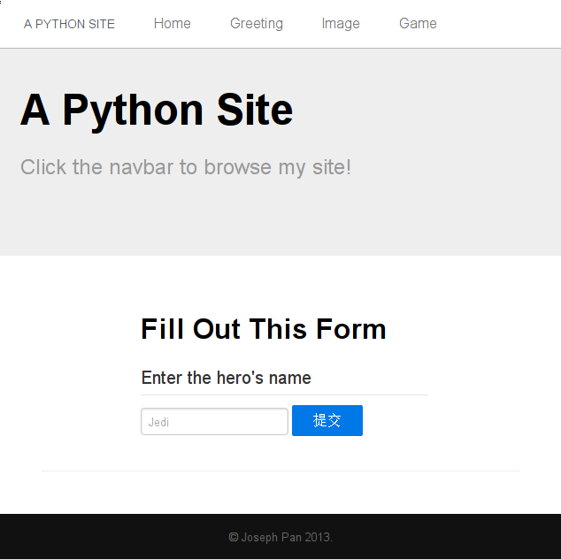
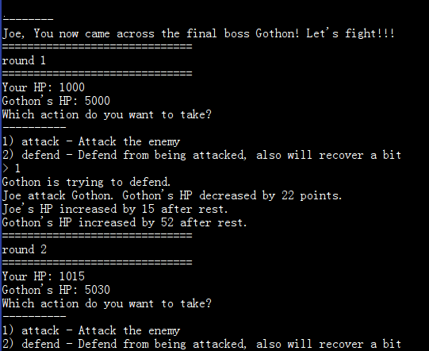

My answer for all exersices from Zed. A. Shaw [Learn Python the Hard Way](http://learnpythonthehardway.org/).

All the codes are  written in both Python2(2.7.5) and Python3(3.3.2).

The best way to check my solution step by step is to use `git log` command. For instance,

``` sh
$ git log -p Python2/ex04.py
```

Alternatively you can browse the history of any file on Github to see the change of it.

If you got a better answer, welcome to comment the code and share your version!

### Screenshots ###

1. The final web page game(ex52):



2. A little battle system(ex47):



